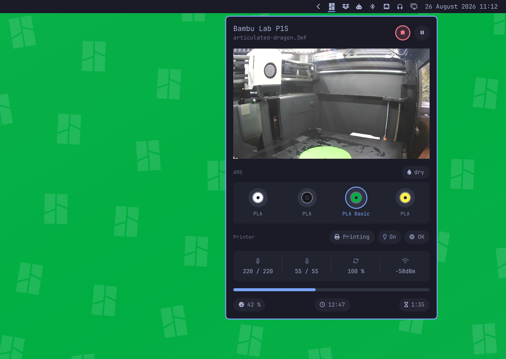
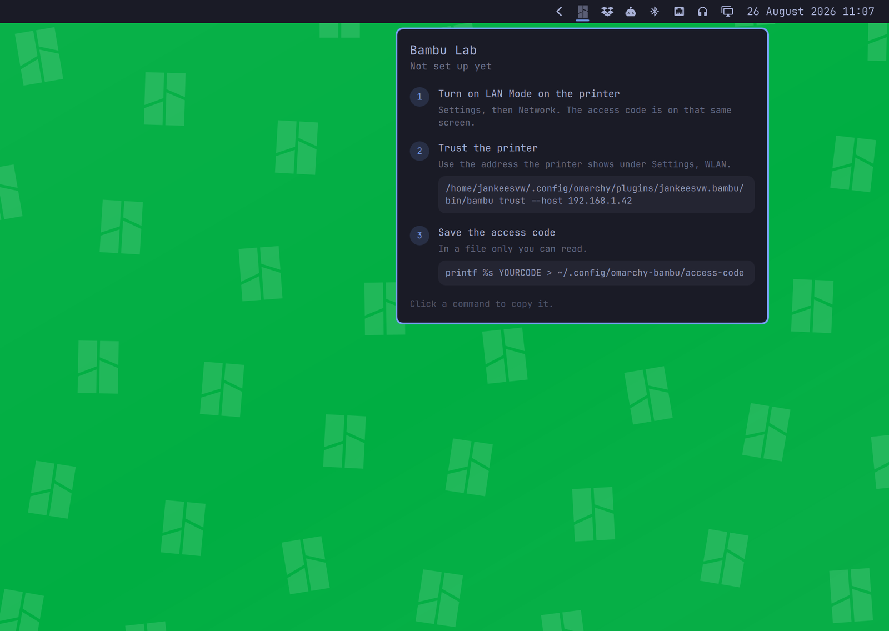
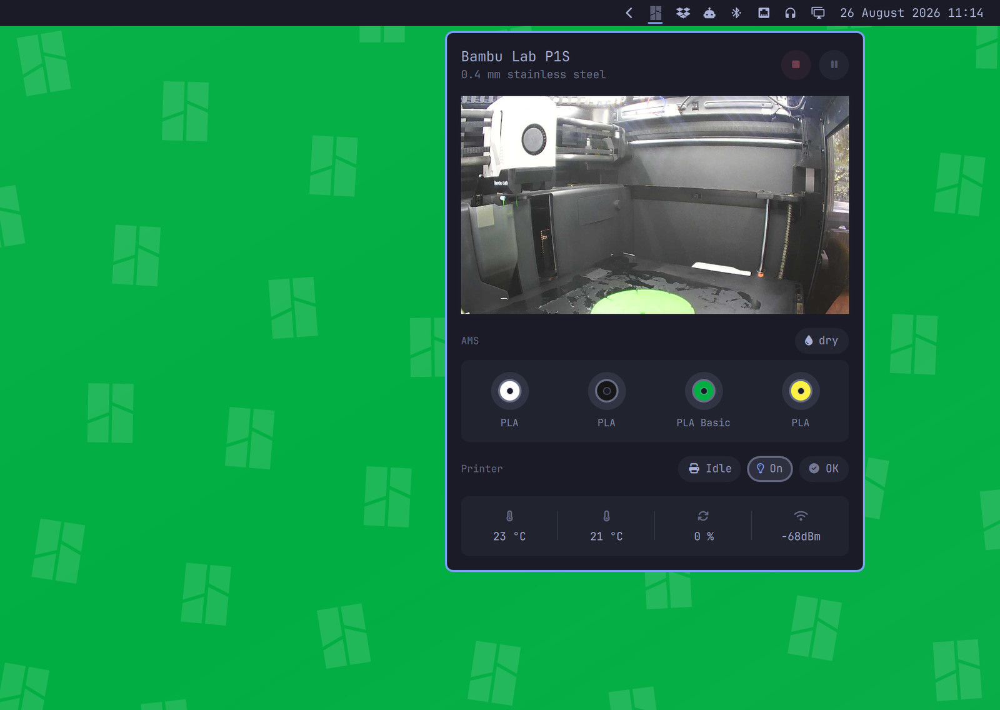
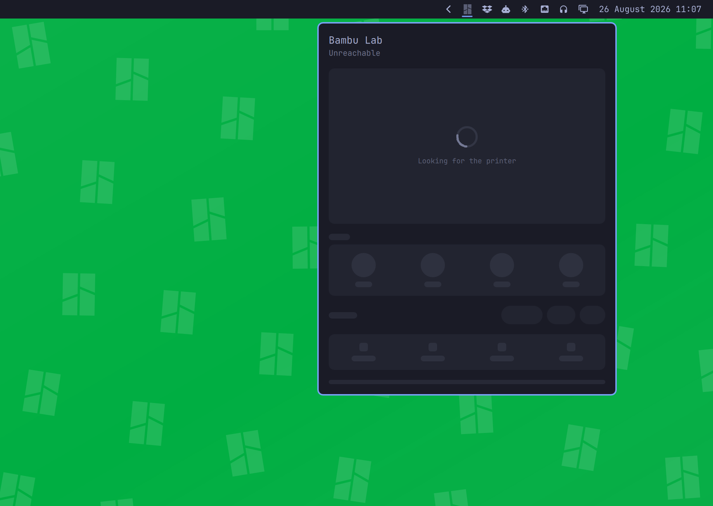

# Bambu Lab

Your printer in your bar, over your own network, without going through anybody's cloud.

A print is a thing you start and then walk away from for eleven hours. This puts one mark in the bar that lights up while the printer is working and turns red when it wants you, and a panel behind it that answers what you keep getting up to check: how far along is it, and is it still stuck to the plate.



Click the mark and you get the chamber, the AMS drawn in the real colours of whatever is loaded in it, what the printer says about itself, the temperatures, and how long is left. Plus stop, pause and the chamber light.

The bar itself stays quiet. One mark in the colour of your theme, dimmed while nothing is happening. No percentage counting at you, no badge, nothing that moves.

## Install

```bash
omarchy plugin add https://github.com/jankeesvw/omarchy-bambu-lab
omarchy plugin enable jankeesvw.bambu-lab
omarchy bar move jankeesvw.bambu-lab --section right
```

Nothing else to install. The printer speaks MQTT and this speaks MQTT, in a few hundred lines written on the Python standard library, so there is no package to add.

It leans on what an Omarchy install already has: `python3`, `jq`, `openssl` and `sha256sum` for talking to the printer, and `notify-send`, `xdg-open` and `wl-copy` for the notifications, the error links and the copy buttons. If one of the last three is missing, that feature quietly does nothing and the rest carries on.

## Setting it up

The panel walks you through it. Until it's pointed at a printer it shows the three steps instead of a dashboard, and the commands copy themselves when you click them.



**Find the access code on the printer.** On a P1P or P1S, turn the knob to open the menu, go to **Settings**, then **WLAN**. That one page has everything you need: the printer's IP address, the **Access Code**, and the **LAN Only Mode** switch.

On an X1, H2 or P2 it lives under **Settings, LAN Only**. On an A series, tap **Settings** and scroll to the third page for **LAN Only Mode**.

The access code is eight characters. Write it down, you need it in a minute. It changes whenever you toggle LAN Only Mode off and on again, so if you plan to switch modes, do that first and read the code afterwards.

While you are on that page, turn on **LAN Mode Liveview**. That is what lets the panel show you inside the chamber.

**Then trust the printer**, using the IP address from that same page:

```bash
~/.config/omarchy/plugins/jankeesvw.bambu-lab/bin/bambu trust --host 192.168.1.42
```

```
Printer at 192.168.1.42

  Serial       01P00A000000000
  Issuer       C = CN, O = "BBL Technologies Co., Ltd", CN = BBL CA
  Expires      Apr  3 01:24:17 2034 GMT
  Fingerprint  3b1f8c04d7a2e95610bd47f8e2c091aa5d63b7e401f9c28d5a7e3b1029fd64c8

Trust this printer? [y/N]
```

Say yes and it remembers that certificate. You never type the serial number: it's printed inside the certificate, which is where this reads it from.

**Finally the access code**, into a file only you can read:

```bash
install -m 600 /dev/null ~/.config/omarchy-bambu-lab/access-code
printf %s YOUR_CODE > ~/.config/omarchy-bambu-lab/access-code
```

The mark in your bar wakes up within a few seconds.

## What the panel shows you



**The chamber**, a frame or two a second. A P1 has no video stream to offer, so this is a sequence of stills, which is enough to answer the question you opened the panel for. It only runs while the panel is open.

**The AMS**, one spool per slot in the colour the printer reports, with the type underneath. The spool feeding the nozzle gets a ring around it. Two-tone filaments are drawn in both their colours. A slot with nothing in it is drawn as an empty holder rather than left out, so the four slots stay where you expect them.

**What the printer says about itself:** what it's doing, whether the chamber light is on, and whether it has raised any errors. The light chip is a button. If there's an error the chip carries the HMS code, and clicking it opens Bambu's own page about that code.

**Nozzle and bed**, current and target, the part fan, and the wifi signal.

**While a print is running**, a progress bar with the percentage, the clock time it expects to be done, and how long that is from now. "Done at 17:42" is something you can plan an evening around in a way that "1:35 left" is not.

## When the printer is off



Most evenings, the printer is off. The panel keeps its size and shape and shows the outline of itself with a spinner in it, rather than an apology on an empty card. It reconnects on its own when the printer comes back, and the mark in the bar stays dimmed until it does.

## Controlling the printer needs LAN Only mode

Watching works out of the box. **Controlling doesn't**, and it catches people out, so it's worth being plain about.

From firmware 01.07 onwards, a P1 that is signed in to Bambu's cloud ignores stop, pause and resume when they arrive over the local network. It doesn't refuse them and it doesn't answer. It carries on reporting its state as though nothing was said. No client can talk its way past this, because the refusal is in the printer.

There is one way through: put the printer in **LAN Only Mode**, on the same page where you found the access code. That unbinds it from Bambu's cloud, and then the buttons work. The trade is real. No Bambu Handy app, no cloud slicing, no access from outside your house. Your call.

If you leave it in cloud mode everything else still works, and a button that did nothing tells you why instead of failing silently.

## Why it asks you to trust a certificate

Your printer almost certainly has a DHCP lease, which means `192.168.1.42` is a guess about who is listening, not a statement about who they are. Leases move. Devices get swapped.

That matters more than usual here, because the LAN access code is the only credential the printer has. There is no second factor, you cannot scope it down, and anything holding it can drive your printer. Handing it to whatever happens to answer on an address is not something you want your bar doing quietly every thirty seconds for a year.

So the fingerprint is checked first, before the access code goes anywhere near the wire. If something else answers on that address, the connection is dropped without ever introducing itself. If the printer genuinely moves, the panel goes quiet and you run `bambu trust` again, which is the right amount of friction for "the thing I am about to hand my credential to has changed".

## Other Bambu printers

Built and tested against a **P1S**.

**Watching works on all of them.** The MQTT protocol, covering state, AMS, temperatures and progress, is shared across the X1, P1, A1 and H2 families, and the printer names itself, so the panel says which one it is rather than guessing.

**The camera works on all of them, in two ways.** The P1 and A1 families serve stills on port 6000, which this reads directly. The X1, H2, P2 and X2 families serve RTSP video on port 322 instead, which `mpv` decodes into a couple of frames a second for the panel. Omarchy ships `mpv`; nothing else is needed. The video only exists once **LAN Mode Liveview** is on, which is a separate switch from LAN Only Mode: the printer stays on Bambu's cloud. As with every other connection, the certificate on port 322 is checked against the pin before the access code is used, and the code reaches `mpv` through a private file rather than its command line. Tested on an **X2D**.

**The buttons are the other way round.** The cloud-blocks-local-control behaviour above is P1-only, so an X1 or an A1 should take stop, pause and resume without being put in LAN Only mode.

## Settings

Right-click the bar and choose Configure, or edit `~/.config/omarchy/shell.json`.

| Setting | Default | What it is for |
|---|---|---|
| Printer address | empty | Where the printer is. Setting up remembers this, so fill it in only when the printer moves to a different address. |
| Panel width | 420 | The AMS row is measured off this, so this one number sizes the whole panel. |
| Show the chamber camera | on | The view inside the printer. Only runs while the panel is open. |
| Keep a finished print lit for | 10 minutes | How long the mark stays lit after a print ends, so news that arrived while you were downstairs is still there when you get back. Zero turns it off. |
| Notify when a print finishes | on | A desktop notification when it is done. |
| Notify when something goes wrong | on | The one worth leaving on. A print that failed on layer nine will otherwise spend the night extruding into air. |
| Show the external spool | on | The holder on the back. Only appears when something is loaded in it. |

## Command line

```bash
bambu status                 # what is set up and what is missing
bambu watch                  # printer state as JSON, a line per change
bambu camera                 # chamber frames; prints the path of each
bambu video                  # the same, from printers that send RTSP video
bambu pause | resume | stop
bambu light on | off
bambu demo on | off          # fixed data for screenshots; commands do nothing
```

## If something is not working

The panel says what it knows: whether it has been set up, whether the access code was accepted, and whether the printer is answering. For anything more:

```
$ bambu status
Printer     192.168.1.42
Serial      01P00A000000000
Certificate 3b1f8c04d7a2e95610bd47f8e2c091aa5d63b7e401f9c28d5a7e3b1029fd64c8
Access code set
```

That reads two local files and nothing else, so it answers straight away whether or not the printer is on.

**The panel keeps saying it is looking for the printer.** The printer is off, asleep, or on a different address than the one that was pinned. `bambu watch` prints what it is trying and why it is failing, a line at a time.

**Wrong access code.** The code changes when you toggle LAN Mode off and on again at the printer. Read it off the printer screen and write it out again; the panel picks it up on the next attempt.

**This is not the printer you trusted.** Something else is answering on that address, usually because the printer took a new DHCP lease and another device took its old one. Check the address on the printer screen, then run `bambu trust --host <new address>` and confirm the serial matches.

**The camera stays empty.** LAN Mode Liveview is off at the printer. On an X1, H2, P2 or X2 the video also needs `mpv`; the panel says so if it is missing.

**A button did nothing.** See LAN Only mode, above.

## Removing it

```bash
omarchy plugin remove jankeesvw.bambu-lab
```

That takes the widget and leaves two directories.

`~/.config/omarchy-bambu-lab/` holds your **access code**, the **pinned certificate**, and your printer's serial and address. The access code is the one that matters: it is a live credential for your printer.

`~/.cache/omarchy-bambu-lab/` holds the **last few camera frames**, pictures of the inside of whatever room your printer is in. Only four, always overwritten, never uploaded anywhere, but they are on your disk and you should know it.

```bash
rm -r ~/.config/omarchy-bambu-lab ~/.cache/omarchy-bambu-lab
```

Nothing else is written anywhere. No history, no print log.

## Credit

The protocol work stands on [greghesp/ha-bambulab](https://github.com/greghesp/ha-bambulab), the Home Assistant integration that worked out what the printer is saying. The spools take their shape from that project's companion cards, redrawn in QML.

Neither that project nor Bambu Lab has anything to do with this one.

## Licence

MIT.

The mark in the bar is the Bambu Lab logo from [Simple Icons](https://simpleicons.org), licensed CC0.

The protocol notes and command shapes come from [greghesp/ha-bambulab](https://github.com/greghesp/ha-bambulab), licensed MIT, and its [companion cards](https://github.com/greghesp/ha-bambulab-cards), licensed ISC.

The wallpaper behind the screenshots is a pattern built from that same Simple Icons logo.
